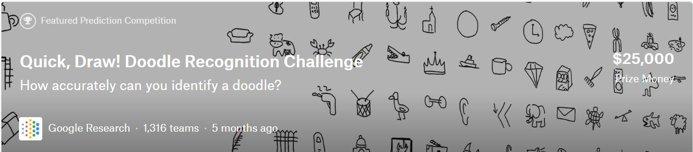
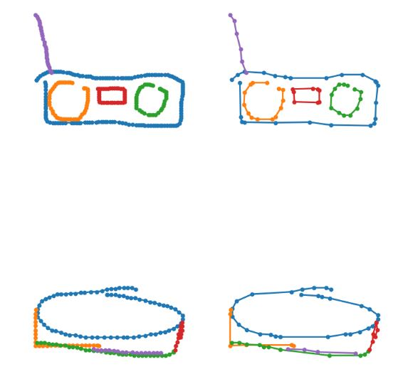

## **이번 포스팅에서 알아볼 내용**
### [[kaggle]캐글 시작하기]
<!--more-->
다른 사람이 한 Big Data 분석 결과도 볼 수 있고, 잘하면 상금까지 거머쥘 수 있는 kaggle...!

미루고 미루어 왔던 데이터 분석을 이제야 시도해보려고 한다. 

아래는 참고한 포스팅들 - 감사합니다(__) -

1. [Kaggle에 대해서 알아보자!!](https://bit.ly/2vY5cuN)

2. [Kaggle에서 얻을 수 있는건?](https://bit.ly/2Vo9oya)

여차저차해서 Kaggle에 가입까지 하고, 첫 kernel을 만들었다. 

두번째 글에서 인용하자면 `모방은 창조의 어머니` 동의한다 ^_^

무작정 시작하기 보다는, 잘하는 사람의 kernel을 필사하는 것부터 하기로 했다.

### 입문
[](https://bit.ly/2JiHAtt)

### 커널 필사 
1. [Getting Started: Viewing Quick, Draw! Doodles, etc](https://bit.ly/2vY8xKi)


- 파이썬에서 data를 읽고, 분석할 준비
- raw drawing data를 simple 하게 바꾸어줌 ( ex. 8개의 점으로 연결된 직선을 2개의 점으로 연결된 직선으로 갼결화)
- 정해진 format에서 prediction을 포함한 submission을 만드는 방법

string 값으로 저장된 drawing data를 list로 바꾸어주기 위해 ast.literal_eval

오차 범위 내에서 직선을 간결하게 해주기 위해 [simplification](https://bit.ly/30fCtPY).cutil라이브러리 내의 simplify_coords

를 사용합니다. 


#### Constraints

S will consist only of letters or digits.

$1 \leq S.length() \leq 12$

가능한 permutation의 최대 개수는 $2^{12} = 4096$ 입니다.

왜냐하면, 가장 긴 문자열의 길이가 12이고, 문자 각각 invert 되느냐/ 안되느냐 2가지의 경우의 수를 가지기 때문입니다.

### 2. 알고리즘

#### 알고리즘 설명
Backtracking Algorithm 을 연습하고자 푼 문제입니다. 

Backtracking은 가능한 모든 조합을 찾으면서 `가능성 있는 해`를 찾는 알고리즘입니다. 

~기회가 된다면 꼭 포스팅을...!~

어떻게 풀긴 했는데 영 코드가 지저분하고 비효율적이라 

더 효율적이고 깔끔한 코드를 먼저 소개하겠습니다. ~~(속상) ~~

#### 코드 설명 [C/C++]
1) XOR 연산 : s[i] ^= (1 << 5);

아스키코드에서 'A' = 65 , 'a' = 97 입니다. 

이 두 문자의 차이가 32인 점을 이용하여 비트연산으로 대문자/소문자 변환을 쉽게 할 수 있습니다. 

바로, 32를 나타내는 비트(100000)를 이용해서 XOR 연산을 해주는 것입니다. 

XOR 은 두 비트가 서로 다르면 1을 , 같다면 0의 값을 줍니다. 

따라서, 대문자는 32에 해당하는 비트가 0일 것이기 때문에 1로 반전되어 소문자가 되고 

소문자는 32에 해당하는 비트가 1일 것이기 때문에 0으로 반전되어 대문자가 됩니다. 

// C : <ctype.h> , C++ : <string>
2) tolower/toupper

C/C++에는 문자를 소문자 또는 대문자로 변환하는 함수가 있습니다. 

- int tolower(int c);
- int toupper(int c);

각각의 함수는 인자로 들어온 문자에 대응하는 대문자나 소문자를 반환합니다. 

대응하는 것이 없다면 바꾸지 않고 그대로 문자를 돌려줍니다.

2) isalpha

- int isalpha(int c);

주어진 문자가 알파벳이 아니면 0을 반환합니다.

#### 코드 [C/C++]
- Runtime: 12 ms
- Memory Usage: 12.7 MB

```cpp
class Solution {
    void backtrack(string &s, int i, vector<string> &res) {
        if (i == s.size()) {
            res.push_back(s);
            return;
        }
        backtrack(s, i + 1, res);
        if (isalpha(s[i])) {
            // toggle case
            s[i] ^= (1 << 5);
            backtrack(s, i + 1, res);
        }
    }
public:
    vector<string> letterCasePermutation(string S) {
        vector<string> res;
        backtrack(S, 0, res);
        return res;
    }
};
```

#### 코드2 [C/C++]
- Runtime: 32 ms
- Memory Usage: 26.6 MB

```cpp
vector <bool> check(13,false);

class Solution {
public:
    vector<string> letterCasePermutation(string S) {
        vector <string> result;
        vector <int> character;
        // 알파벳이 위치하는 idx를 따로 저장해둡시다.
        for(int i = 0 ; i < S.length();i++)
        {
            if(('A' <= S[i] && S[i]<='Z') || ('a' <= S[i] && S[i]<='z') )
            {
                character.push_back(i);
            }
        }
        // 모두 숫자라면 ? 주어진 문자열만 넣고 ㅂㅂ 
        if(character.size() == 0)
        {
            result.push_back(S);
        }
        // 아니면 백트래킹 ㄱㄱ
        else
        {
            backTrack(result,character,S,0,0);
        }    
        
        return result;
        
    }
    
    
    void backTrack(vector <string> & result_vec, 
                   vector<int> idx_vec,
                   string s, 
                   int cnt, 
                   int idx)
    {
        // cnt 와 idx 모두 문자의 총 개수(idx_vec.size())를 넘길 수 없어요.
        if(cnt > idx_vec.size() || idx > idx_vec.size())
            return;
        
        else
        {
            // cnt == idx_vec.size() 이면 조합이 끝난겁니다.
            // 만약에, 2개의 문자가 주어졌을 때 cnt가 0이라면 선택 유무를 모릅니다. (?,?) << 이런식으로
            // cnt 가 1이라면 (true,?),(false,?)
            // cnt 가 2라면 (true,true),(true,false),(false,true),(true,false) 와 같이 모든 조합이 만들어진 것을 볼 수 있습니다.
            if(cnt == idx_vec.size())
            {
                string tmp = s;
                for(int i = 0; i< idx_vec.size();i++)
                {
                    if(check[i])
                    {
                        int c_idx = idx_vec[i];
                        if('A' <= tmp[c_idx] && tmp[c_idx]<='Z')
                        {
                            tmp[c_idx] = tmp[c_idx]+32;
                        }
                        else if('a' <= tmp[c_idx] && tmp[c_idx]<='z')
                        {
                            tmp[c_idx] = tmp[c_idx]-32;
                        }
                    }
                }
                result_vec.push_back(tmp);
                return;
            }
            check[idx] = true;
            backTrack(result_vec,idx_vec,s,cnt+1,idx+1);
            check[idx] = false;
            backTrack(result_vec,idx_vec,s,cnt+1,idx+1);

        }
    }
};
```
